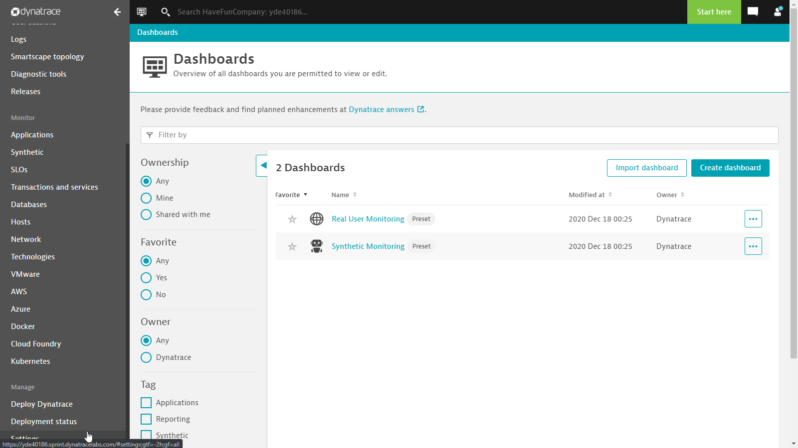
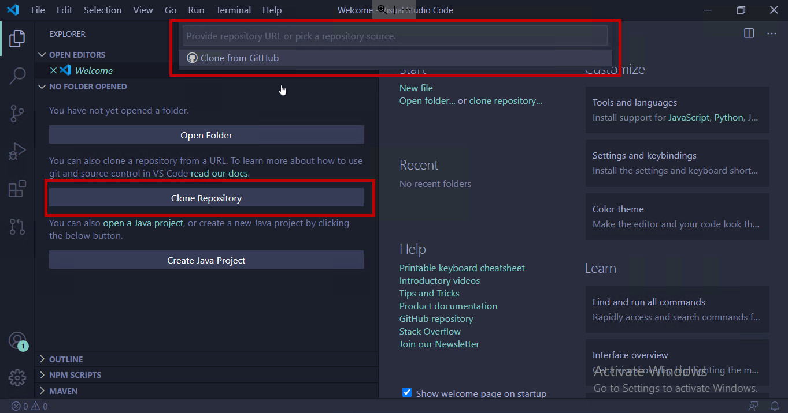
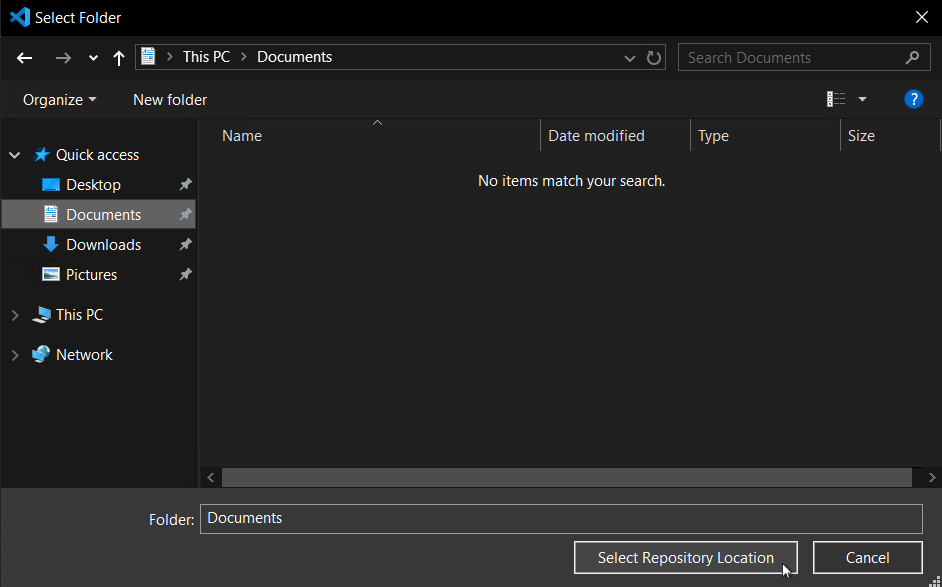
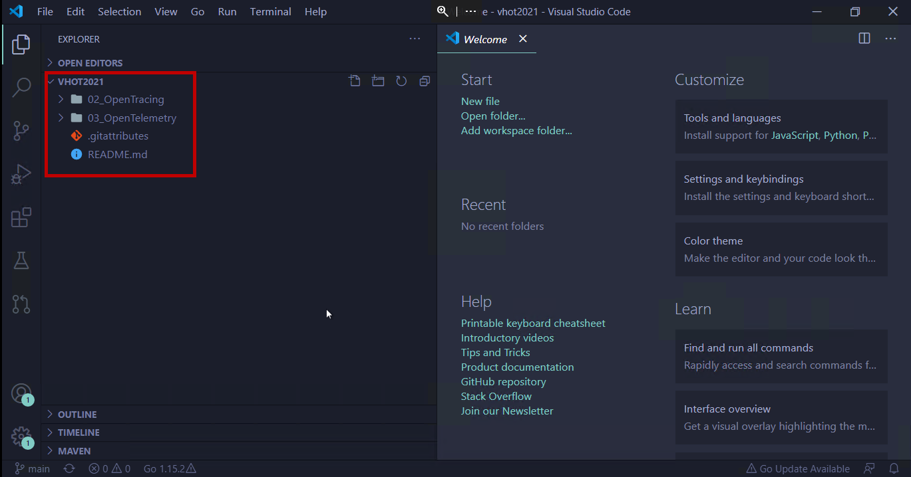

## Prepare the environment
In this step we will prepare the environment for the hands on exercises
- Install OneAgent
- Enable OpenTelemetry instrumentation
- Clone the repos for the Java and Go exercise

### Step 1: Install OneAgent
- Access the Dynatrace tenant provided to you
- In your RDP Windows instance provided to you, download the Windows-based OneAgent from Deploy Dynatrace menu
- Start the installation with default settings

### Step 2: Enable OpenTelemetry and OpenTracing instrumentation
- Go to your environment, under `Settings` > `Server-side service monitoring` > `Deep Monitoring` > `OpenTelemetry and OpenTracing`
- You might also be required to go to `New OneAgent features` to enable some flags
  

### Step 3: Clone the repos
- Launch Visual Studio Code
- Click on `clone repository`, and copy/enter

  `https://github.com/Dynatrace-APAC/vhot2021.git`

  
- Select the folder (e.g. Documents folder) to store the cloned repo 
  
- If prompted to open the cloned repository, click on `Open`

  

### You've arrived
- You are now ready to start the hands on!
  
