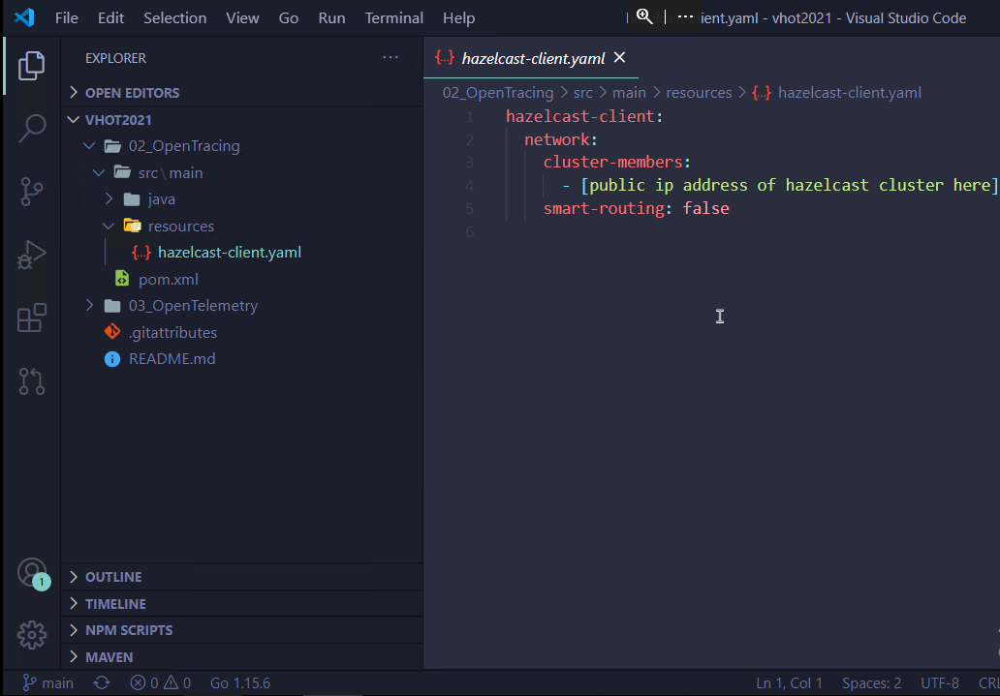
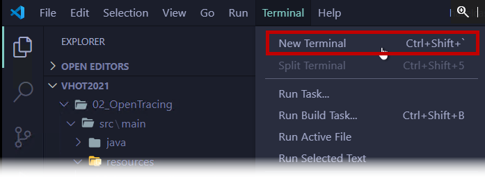

## OneAgent out-of-the-box instrumentation
In this step we will compile our Java Springboot application and explore the out-of-the-box instrumentation of the OneAgent

### Step 1: Compile and run the application
- Edit `hazelcast-client.yaml` in VHOT2001 > 02_OpenTracing > src\main > resources
  
- Input the public IP address `34.67.1.60`
- Save the file, example `CTRL+S`
- Open up a Terminal from the top menu bar
  
- Change diretory to `02_OpenTracing` and run this command `mvn spring-boot:run`
  ```powershell
  PS C:\Users\dtu.training\Documents\vhot2021> cd 02_OpenTracing
  PS C:\Users\dtu.training\Documents\vhot2021\02_OpenTracing> mvn spring-boot:run
  ```
- Check that the program compiles without any errors and it connects to the HazelCast nodes
- Open a new terminal tab
- Enter `curl http://localhost:8080/get?key=testkey`
- You will observe a response of `{"response":null}`. This is normal as you have not populated the HazelCast map with entries.
  ```powershell
  PS C:\Users\dtu.training\Documents\opentracing-hazelcast> curl http://localhost:8080/get?key=testkey
  
  StatusCode        : 200
  StatusDescription :
  Content           : {"response":null}
  ...
  ```
### Step 2: Populate the HazelCast instance with entries and retrieve the data
- Enter `curl http://localhost:8080/pop1`

```powershell
PS C:\Users\dtu.training\Documents\opentracing-hazelcast> curl http://localhost:8080/pop1

StatusCode        : 200
StatusDescription :
Content           : {"response":"100 entries inserted to the map with key: <your public ip>-* , starting from 1 "}
...
```
- Retrieve the data with the key format as `<your public ip>-1`, example:

```powershell
PS C:\Users\dtu.training\Documents\opentracing-hazelcast> http://localhost:8080/get?key=1.2.3.4-1

StatusCode        : 200
StatusDescription :
Content           : {"response":"1.2.3.4-1"}
...
```

- Execute a few more `get` transactions with different keys
- Once done, go back to the first terminal and terminate the Java program by using `CTRL+C`

```powershell
[INFO] ------------------------------------------------------------------------
[INFO] BUILD SUCCESS
[INFO] ------------------------------------------------------------------------
[INFO] Total time:  17:53 min
[INFO] Finished at: 
[INFO] ------------------------------------------------------------------------
Terminate batch job (Y/N)?
```
Enter Y

### Step 3: Explore Dynatrace PurePaths after auto instrumentation 
- Access your Dynatrace tenant in the browser
- Go to Transactions and Services > CommandController > Purepaths
- Choose the /pop1 transaction
- You will observe that the totoal transaction response time was 3 secs, but all of the Java method calls were less than 30 ms.
- Clearly something else is responsible
