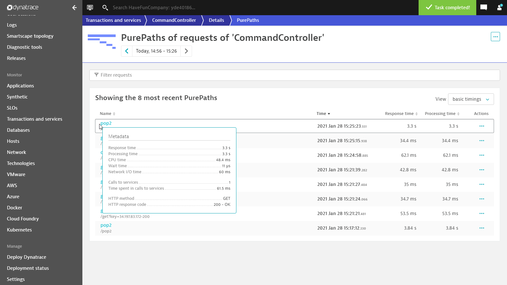

## Using OpenTracing instrumentation libaries
In this step we extend the Java SpringBoot application with an available OpenTracing instrumentation libary.

### Step 1: Decorate the java code with the HazelCast OpenTracing libaries
- Open `CommandController.java` from src\main > java\com\hazelcast\kubernetes
  
- Import the OpenTracing Libraries - Comment line 3 and 7
  ```java
  ///* ~~ OpenTracing ~~
  import io.opentracing.contrib.hazelcast.TracingHazelcastInstance;
  import io.opentracing.Tracer;
  import io.opentracing.util.GlobalTracer;
  //*/
  ```
- Initialze the OpenTracing [GlobalTracer](https://github.com/opentracing/opentracing-java/blob/master/opentracing-util/src/main/java/io/opentracing/util/GlobalTracer.java) - Comment line 28 and 32
  ```java
  ///* ~~ OpenTracing ~~
   public Tracer initTracer() {
       return GlobalTracer.get();
   }
  // */
  ```
- Enhance or warp the HazelcastInstance with [TracingHazelcastInstance](https://github.com/opentracing-contrib/java-hazelcast) - Comment line 35 and 42
  ```java
  // /* ~~ OpenTracing ~~
   if (hazelcastInstance instanceof TracingHazelcastInstance) {
       return hazelcastInstance;
   }
   hazelcastInstance = new TracingHazelcastInstance(
           HazelcastClient.newHazelcastClient(),
           false);
  // */
  ```
- Save the file, example  `CTRL+S`

### Step 2: Compile and run the application
- Ensure that you are in the first terminal tab and run this command `mvn spring-boot:run`
  ```powershell
  PS C:\Users\dtu.training\Documents\vhot2021\02_OpenTracing> mvn spring-boot:run
  ```
- Check that the program compiles without any errors and it connects to the HazelCast nodes

### Step 3: Populate the HazelCast instance with new entries and retrieve the data
- Switch to the 2nd terminal tab
- Enter a few `get` transactions with any values for the key, for example
  ```powershell
  PS C:\Users\dtu.training\Documents\vhot2021> curl.exe http://localhost:8080/get?key=samplekey
  {"response":null}
  PS C:\Users\dtu.training\Documents\vhot2021> curl.exe http://localhost:8080/get?key=1.2.3.4-1
  {"response":1.2.3.4-1}
  ```
- Now, populate the HazelCast cache with new entries, enter `curl.exe http://localhost:8080/pop2`
  ```powershell
  PS C:\Users\dtu.training\Documents\vhot2021> curl.exe http://localhost:8080/pop2
  {"response":"100 entry inserted to the map with key: 1.2.3.4-* , starting with 200 "}
  ```
- Retrieve the data with the key format as `<your public ip>-200`, example:
  ```powershell
  PS C:\Users\dtu.training\Documents\vhot2021> curl.exe http://localhost:8080/get?key=1.2.3.4-200
  {"response":1.2.3.4-200}
  ```
- Execute a few more `get` transactions with different keys (from 200 until 299)

### Step 4: Explore Dynatrace PurePaths after implementing OpenTracing libaries 
- Access your Dynatrace tenant in the browser
- Go to Transactions and Services > CommandController > Purepaths
- Choose the /pop2 transaction
- You will observe that we are getting more visibility into the application execution - we are seeing 100 calls made to hazelcast `put` command, with each command taking about 30 ms, and 100 calls of 30 ms will compound to almost 3 secs!
  
