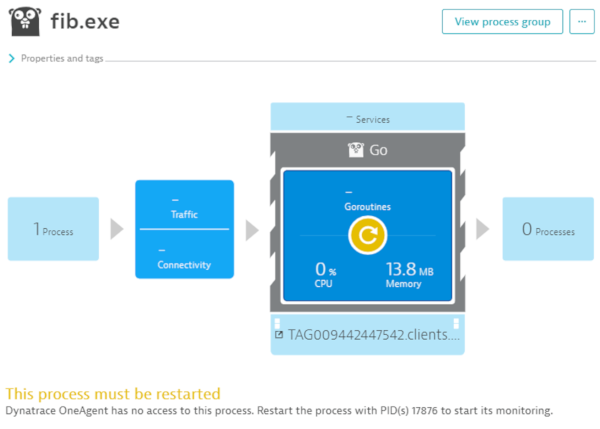

## Producing a simple Span and report it to Dynatrace
In this step we extend a sample program with an additional OpenTelemetry Span.
The sample consists of an HTTP Server which is able to calculate any Fibonacci number.
The result of that calculation is getting sent to a Kafka Broker.

### Prerequisites
- OneAgent is already installed on your Workstation
- OpenTelemetry instrumentation for Golang has been enabled for your Dynatrace Environment (`Settings` > `Server-side service monitoring` > `Deep Monitoring` > `OpenTelemetry and OpenTracing`)
  

### Step 1: Compile and launch the program
- In Visual Studio select `File` > `Open Folder` and choose the `golang` directory of the previously checked out GitHub Repository. TODO: Specify the EXACT directory
- In Visual Studio Code open up a Terminal
- Compile the program using the command line `go build`. This produces a file name `fib.exe` within the current directory.
- Launch `fib.exe` via your current Terminal
  - Windows Security likely will ask you to confirm, that this program is allowed to listen on incoming socket connections.
- In your Dynatrace Environment navigate to `Hosts` and select the Workstation you're working on
- Use either your Browser or `curl http://localhost:28080/fib?n=3` within a new Terminal to access your new HTTP Service
- Wait until `fib.exe` shows up among the Processes on this host
- Dynatrace by default has decided to disable monitoring for this executable (`Process isn't monitored`). Click on the link `monitored technologies` and override the defaults for this Process Group.
- 
- Within your Terminal press `Ctrl-C` to shut down `fib.exe`. Launch `fib.exe` again. 
- Dynatrace in some cases tells you afterwards that this process needs to get restarted yet another time. Within your Terminal press `Ctrl-C` to shut down `fib.exe`. Launch `fib.exe` again. 
- 
- Use either your Browser or `curl http://localhost:28080/fib?n=3` within a new Terminal to access your new HTTP Service
- Wait for a couple of seconds. After that you should see a PurePath for the HTTP request you just sent to your HTTP Service.
  - The contents of this PurePath is produced by out of the box Sensors of OneAgent
- 

### Step 2: Introduce OpenTelemetry to your Application
- Shut down `fib.exe` using `Ctrl-C` within your Terminal if you haven't done so already
- Lines 16-18 in `main.go` are required to initialize OpenTelemetry and configure a minimal Span Exporter
  - Delete Line 15 and Line 19 in order to remove the comment. The function `main()` should now look like this:  
    ```go
    func main() {
      if err := initGlobalTracer(nil); err != nil {
        panic(err)
      }
      /* LESSON 05: EXPORTING METRICS
      initMetricsProvider()
      */
      http.HandleFunc("/fib", FibServer)
      http.HandleFunc("/favicon.ico", faviconHandler)
      http.ListenAndServe(":28080", nil)
    }
    ```
- We will replace the function `FibServer` (Lines 26-36) with an enriched version of that code (Lines 40-57)
  - Delete Lines 28 and 35 in order to remove enable the currently commented out code. The function `FibServer` should now look like this:
    ```go
    // FibServer handles HTTP requests for fibonacci calculation
    func FibServer(w http.ResponseWriter, r *http.Request) {
      tracer := global.Tracer("http")
      ctx := context.Background()

      var span trace.Span
      ctx, span = tracer.Start(ctx, "http-request")
      defer span.End()

      if n, err := getIntParam(r); err != nil {
        http.Error(w, err.Error(), http.StatusBadRequest)
      } else {
        result, numIterations := fibonacci.New().Calc(n)
        reportMetric(n, numIterations)
        kafka.Send(result)
        w.Write([]byte(fmt.Sprintf("%d", result)))
      }
    }    
    ```
- Press `Ctrl-S` to save your changes in `main.go`
- In your Terminal, compile the program using the command line `go build`
- Launch `fib.exe` via your current Terminal
- Use either your Browser or `curl http://localhost:28080/fib?n=3` within a new Terminal to access your new HTTP Service

### You've arrived
- The PurePath you just created now contains an additional PurePath Node created via OpenTelemetry
