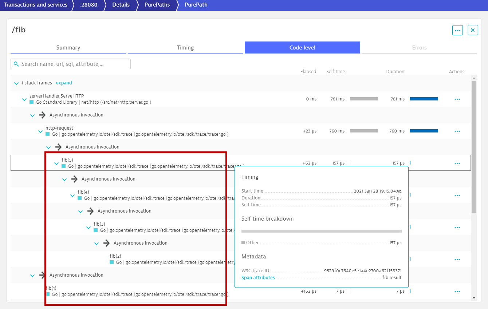
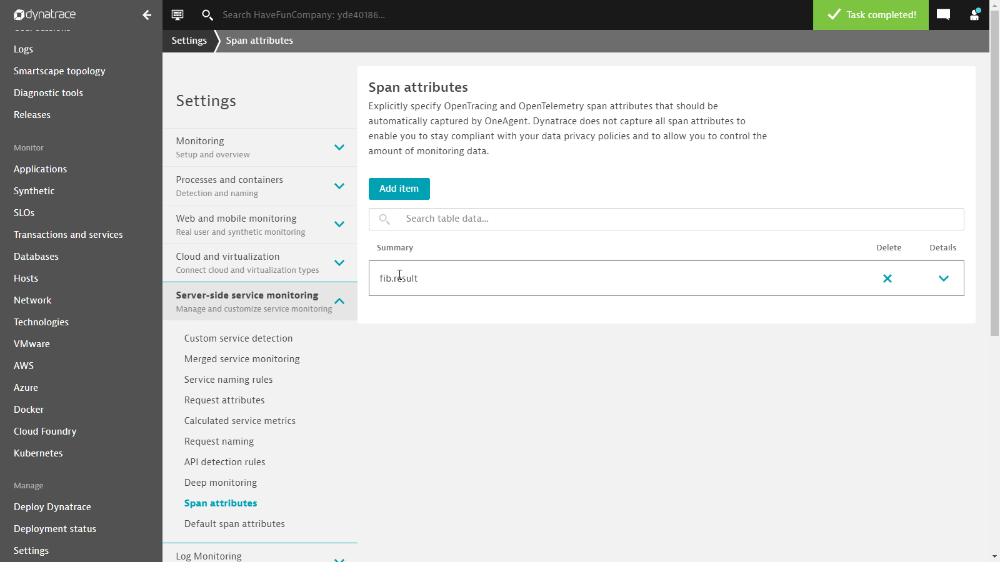
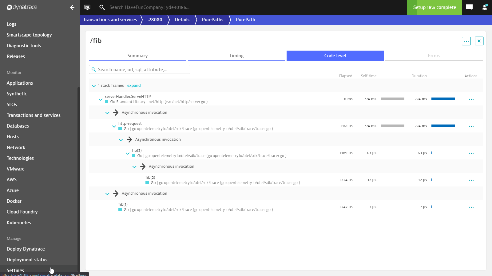

## Child Spans and Span Attributes
The OpenTelemetry Span we just created is more or less redundant. The HTTP Sensor of Dynatrace already created the necessary PurePath Node. Whatever we have introduced via OpenTelemetry doesn't really enrich our experience.
In this task our goal is to grant users of Dynatrace deeper insight into what is going on when the Fibonacci number is getting calculated.

### Prerequisites
- You have completed the previous task `Producing a simple Span and report it to Dynatrace`

### Step 1: Introduce OpenTelemetry functionality into the Fibonacci function
- Delete Line 43 and Line 82 in `fibonacci.go`. It removes the comments around a new version of our Fibonacci code
- Delete Lines 12-41 in `fibonacci.go`. This is the old version of our Fibonacci code. We don't need it anymore.
- The source code for the Fibonacci Calculator should now look like this:
  ```go
    // Fibonacci calculates fibonacci numbers
    type Fibonacci interface {
        Calc(n int) (int, int) // Calc has no documentation
    }

    // New creates a new Fibonacci Calculator
    func New(ctx context.Context) Fibonacci {
        return &fibonacci{Context: ctx}
    }

    type fibonacci struct {
        Context context.Context
    }

    // Calc calculates the n-th fibonacci number
    // The first return value is the fibonacci number to be calculated
    // The second return value reports the number of recursive invocation that were required in order to calculate the result
    func (f *fibonacci) Calc(n int) (int, int) {
        var span trace.Span
        tracer := global.Tracer("")
        f.Context, span = tracer.Start(f.Context, fmt.Sprintf("fib(%d)", n))
        defer span.End()

        if n < 3 {
            span.SetAttributes(label.Key("fib.result").Int(1))
            return 1, 1
        }
        a, iterA := f.Calc(n - 1)
        b, iterB := f.Calc(n - 2)
        result := a + b
        span.SetAttributes(label.Key("fib.result").Int(result))
        return result, iterA + iterB + 1
    }  
  ```
- Press `Ctrl-S` in order to save the changes you've made in `fibonacci.go`
- Because of these changes we are now getting an error in `main.go`. Creating a Fibonacci Calculator now requires an additional parameter
- Delete Line 45 and 65 in `main.go`. It gets rid of the comments around a new version of the function `FibServer`
- Delete Lines 26-43 in `main.go`. This is the old version of function `FibServer`. We don't need it anymore.
- Press `Ctrl-S` in order to save the changes you've made in `main.go`
- Shut down `fib.exe` using `Ctrl-C` within your Terminal if you haven't done so already.
- In your Terminal, compile the program using the command line `go build`
- Launch `fib.exe` via your current Terminal
- Use either your Browser or `curl http://localhost:28080/fib?n=3` within a new Terminal to access your new HTTP Service
- The PurePath you just created now contains an additional PurePath Node per invocation of the Fibonacci Calculator's `Calc` function.
  

### Step 2: Tell Dynatrace which OpenTelemetry Attributes are of interest for you
- In Dynatrace navigate to `Settings` > `Server-side service monitoring` > `Span Attributes`. Add an additional item here. The key you want Dynatrace to capture is `fib.result`.
  
- Use either your Browser or `curl http://localhost:28080/fib?n=3` within a new Terminal to access your new HTTP Service
  

### Step 3: Capture a Request Attribute based on the OpenTelemetry Key
- In Dynatrace navigate to `Settings` > `Server-side service monitoring` > `Request Attributes`.
- The Data Source for our Request Attribute needs to be a `Span Attribute`.
- The Key of the Request Attribute is called `fib.result` (unless you have chosen a different name)
- We are just interested in the last value within the PurePath - any intermediate results should be ignored.
  
- Use either your Browser or `curl http://localhost:28080/fib?n=3` within a new Terminal to access your new HTTP Service
  

### You've arrived
- The PurePath you just created now contains an additional PurePath Node per invocation of the Fibonacci Calculator's `Calc` function. In addition the Request Attribute you just created is also available on every PurePath.
