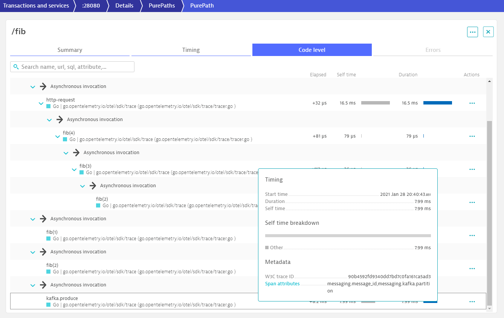

## Instrumentation Libraries
Compile Time instrumentation might be fun to some extent, but it's usually not your job to do that.
The idea behind OpenTelemetry is that third party software either already comes fully instrumented (with all the necessary source code for OpenTelemetry included) or alternatively is getting provided as an optional feature via a helper library.

### Prerequisites
- You have completed the previous task `Child Spans and Span Attributes`

### Step 1: Introduce OpenTelemetry via instrumentation library
- Line 12 in `kafka.go` refers to the Kafka Broker that is supposed to receive messages. Replace it with the URL you've been given from your instructor at the beginning of this task.
- Line 37 in `kafka.go` represents the magic that's required to introduce OpenTelemetry Tracing capabilities to an existing Kafka Producer
  - Delete Lines 36 and 38 in order to get rid of the comment
  - The function `newSyncProducer` should now look like this
  ```go
    // newSyncProducer has no documentation
    func newSyncProducer(brokers []string) (sarama.SyncProducer, error) {
        config := sarama.NewConfig()
        config.Version = sarama.V2_0_0_0
        config.Producer.Return.Successes = true

        producer, err := sarama.NewSyncProducer(brokers, config)
        if err != nil {
            return nil, err
        }

        producer = otelsarama.WrapSyncProducer(config, producer)
        return producer, nil
    }  
  ```
- Press `Ctrl-S` in order to save the changes you've made in `kafka.go`
- Shut down `fib.exe` using `Ctrl-C` within your Terminal if you haven't done so already.
- Compile the program using the command line `go build`. This produces a file name `fib.exe` within the current directory.
- Launch `fib.exe` via your current Terminal
- Use either your Browser or `curl http://localhost:28080/fib?n=3` within a new Terminal to access your new HTTP Service
- The PurePath you just created contains an additional PurePath Node for when the application reaches out to the Kafka Broker
  

### Step 2: Introduce OpenTelemetry via instrumentation library
- Investigate the additional PurePath Node. What additional data does it potentially offer?
- Introduce - like in LESSON 02 - the necessary configuration settings in order to capture that information
- Optionally you can also make that data available via Request Attribute
  - Why is not necessarily EVERY Span Attribute also a candidate for a Request Attribute?

### You've arrived
- You have successfully instrumented Kafka Client communication without modifying the original library.
