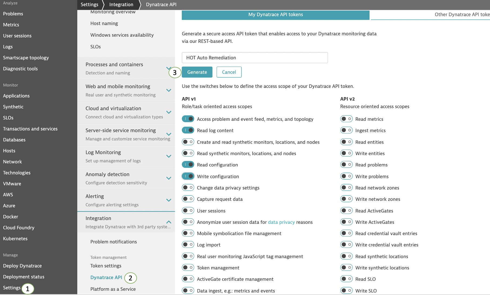
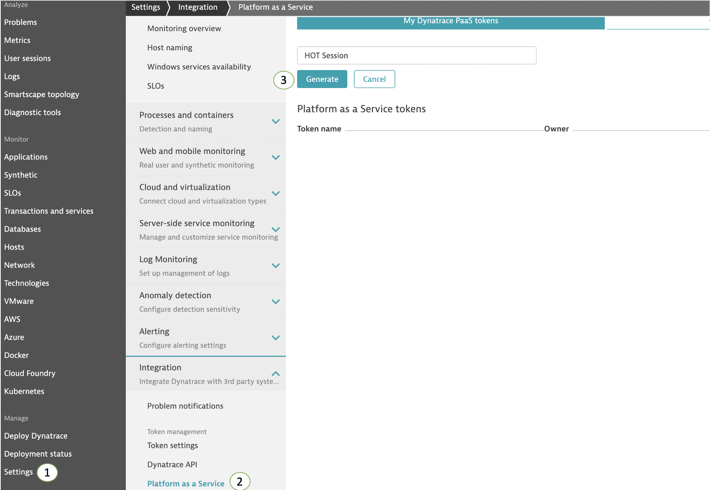

## Dynatrace Credentials

In this step we will create the dynatrace tokens needed to download and install the `OneAgent` as well as authenticate with the `Dynatrace` REST API.

1. On your dynatrace environment, navigate to `Settings -> Integration -> Dynatrace API` and create a new API token with any name and assign it the following scope (API v1):
    * Access problem and event feed, metrics, and topology
    * Read log content
    * Read Configuration
    * Write configuration

    

1. Navigate to Settings -> Integration -> Platform as a service and create a new PAAS token with any name.

    

1. Store both tokens on a secure place as they won’t be accessible again through the Dynatrace UI.
