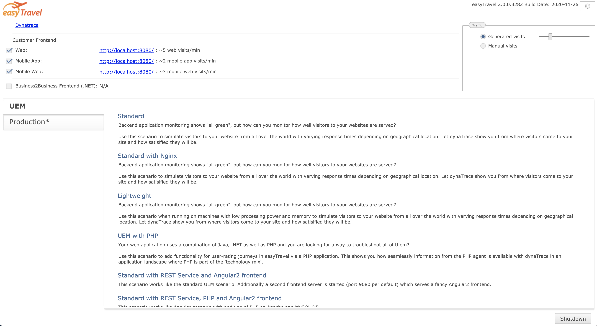
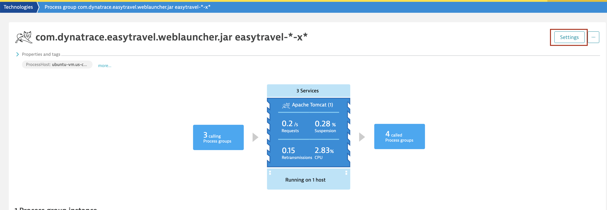

## Install easyTravel

1. Install `easyTravel` by running the following commands:

    ```bash
    cd ~/easyTravel/
    ```

    ```bash
    java -jar dynatrace-easytravel-linux-x86_64.jar -y
    ```

    ```bash
    ./install_easytravel.sh
    ```

    **Note:** The easyTravel URL will be part of the script execution output.

1. After the script finishes executing, ensure you can access both the easyTravel management console on port `8094` and the easyTravel app itself on port `8080`:

    
    

1. Enable visibility of problem patterns by clicking on the gear icon on the top right corner of the easyTravel management portal and proceed to select `Show Problem Patterns`:
    

1. Click on `Problem Patterns` tab on the left side of the portal and search for the `MediumMemoryLeak` problem pattern to ensure it's present.

    

1. Navigate to Technologies and filter by `Name: com.dynatrace.easytravel.weblauncher.jar easytravel-*-x*`.

1. click on the process group `com.dynatrace.easytravel.weblauncher.jar easytravel-*-x*`.

    

1. Click on `Settings` on the top right section of the process group entity:

    

1. Disable monitoring for `com.dynatrace.easytravel.weblauncher.jar easytravel-*-x*`
    