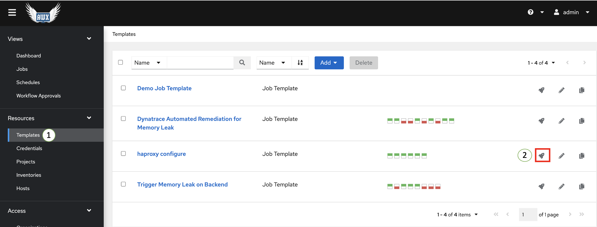

## HAProxy Configuration

In this lab we will be adding your easyTravel app instance behind the existing HAProxy load balancer.

1. In Ansible AWX, navigate to `Templates` and click on the "rocket" icon next to the template named `haproxy configure`.

    

    **Note:** easyTravel Load balanced endpoint URL as well as HAProxy stats page will be part of playbook execution output.

1. Your easyTravel app instance should now be accessible via port 80 behind the HAProxy load balancer.

1. Get your host's private by running the following command:

    ``` bash
    ip a s ens5 | egrep -o 'inet [0-9]{1,3}\.[0-9]{1,3}\.[0-9]{1,3}\.[0-9]{1,3}' | cut -d' ' -f2
    ```

1. Navigate to the HAProxy stats URL `http://xx.xx.xx.xx/haproxy?stats` which will be part of the ansible AWX job output to view the IPs behind the HAProxy load balancer:

    

    **Note:** The HaProxy stats page can also be retrieved by running this command:
    ``` bash
    echo http://$(cat extra_vars.json | jq -r .haproxy_ip)/haproxy?stats
    ```
