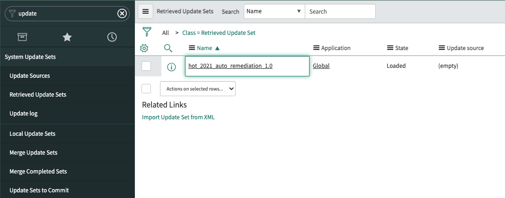
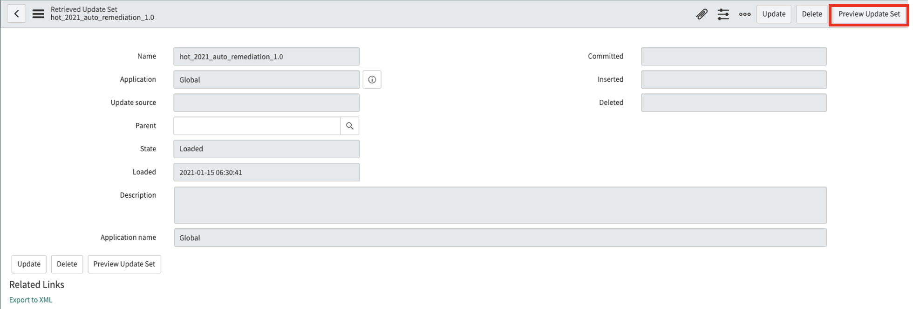
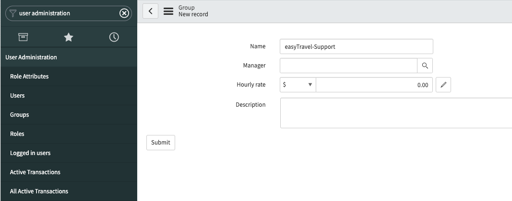

## Install Update Set

### Import and commit update set

A ServiceNow Update Set is provided to run this tutorial. To install the Update Set follow these steps:

1. Download the update set xml file [hot_2021_auto_remediation_1.0.xml] to your computer.
1. Login to your ServiceNow instance.
1. Type `update` in the left filter navigator and go to `System Update Sets` -> `Update sets to Commit`:
    
1. Click on Import Update Set from XML
1. On the import update set screen click on the `choose` button and select the `hot_2021_auto_remediation_1.0.xml` file from its location on your computer.
1. Import and Upload the file [hot_2021_auto_remediation_1.0.xml] file.
1. Click the Upload button.
1. Open the `hot_2021_auto_remediation_1.0` Update Set.
    
1. In the right upper corner, click on Preview Update Set and 
    
1. After successfully previewing ther update set, click on `Commit Update Set` to add the required configurations required for this lab to your instance.
    
1. Review the newly imported subflow named `Trigger ansible AWX Template` by navigating to `Process Automation` -> `Flow Designer`. Click on the Subflows tab and then search for `Trigger ansible AWX Template` under the Name column.

### Create easyTravel support group

1. On your ServiceNow instance go to `User Administration` -> `Groups`.

1. Click `New`

1. Create a new group with the **Name** set to `easyTravel-Support` (Case Sensitive).

    

1. Click `Submit`.

[hot_2021_auto_remediation_1.0.xml]: ../../../assets/hot_2021_auto_remediation_1.0.xml
