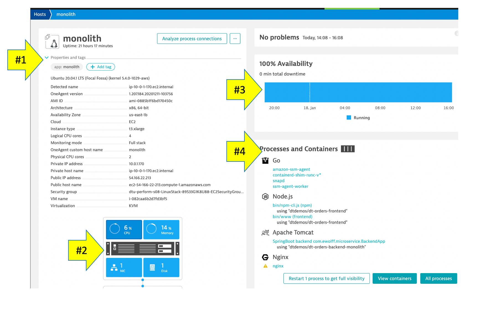

## Host view

In this next few sections, review what the OneAgent automatically discovered for the host, services, processes, and the complete dependency mapping for the sample application.  

From the left-side menu in Dynatrace choose **hosts** then click on the host with the name **monolith**.

💥 **TECHNICAL NOTE**: This host has this name since we added the option to set it during the OneAgent install process.  `/bin/sh Dynatrace-OneAgent-Linux-1.207.184.sh --set-host-name=monolith`  This is just [one of the ways](https://www.dynatrace.com/support/help/how-to-use-dynatrace/hosts/configuration/set-custom-host-names-in-dynamic-environments/) to customize host naming. 

On host page, you will see basic infrastructure information for the host.

1. Now expand the **Properties** section to see data about the host:
1. Host resource metrics (CPU, memory)
1. Host availability
1. Discovered processes. In this case most of which are Java applications running in Tomcat.

💥 **TECHNICAL NOTE**: 
Dynatrace University has an interface that runs on nginx which are installed before the OneAgent is, so a warning on ungix is OK.

## How this helps

As you plan your migration, each of these views will give insights in accessing the profile, consumption and dependencies to other systems and services.