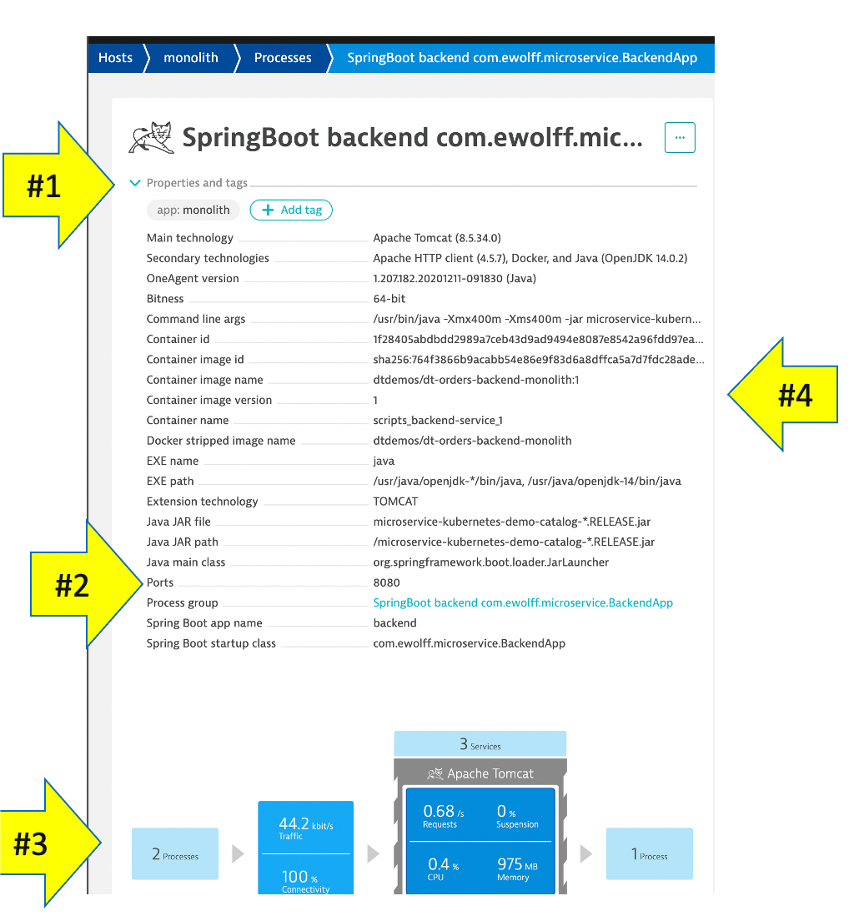
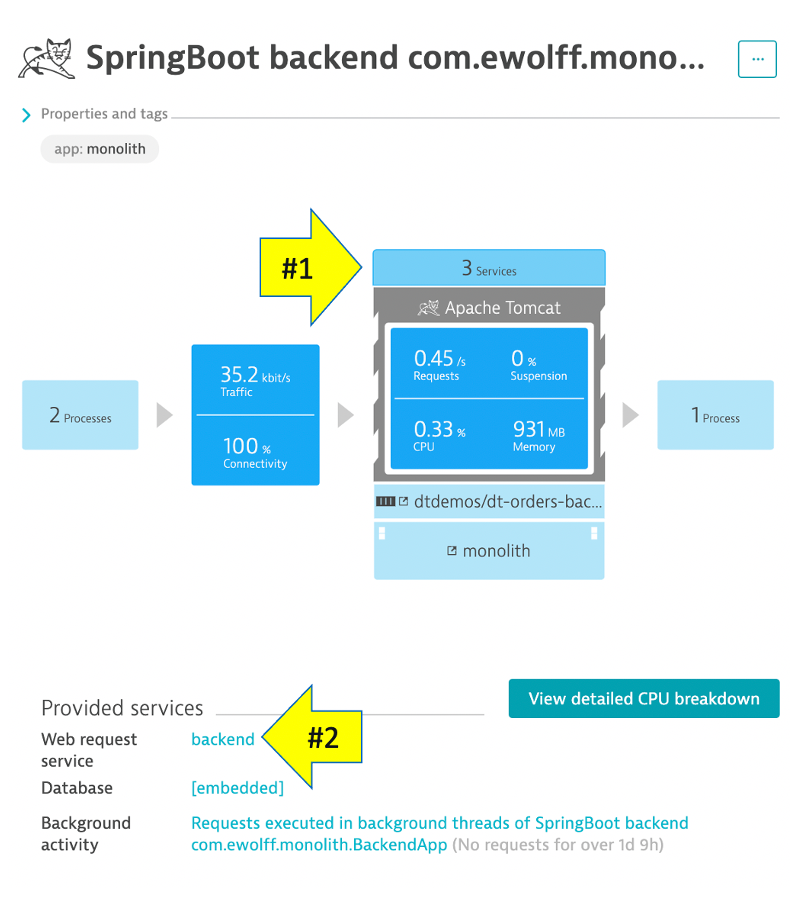
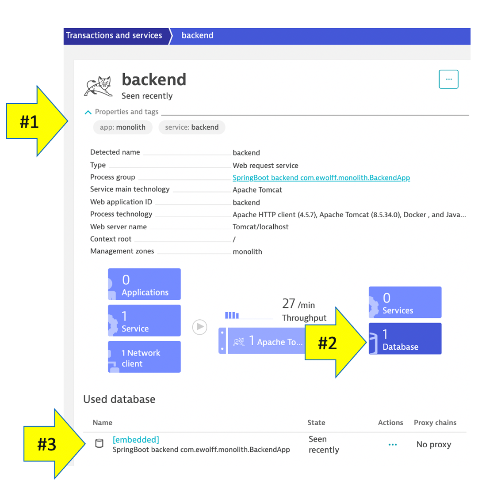

## Process

In the Smartscape view, we saw the visualizations of the relationships in vertical stack and as well as the relationships spatially. Now Let’s view the process and service running on the host.

As you plan your migration, you need more than just host level metrics.  Knowing the details for each services, **BEFORE** you change it, will lower the risk of impacting the business.

### Host view

Return back to the host view for the host with the prefix of **monolith** and locate the **Processes and Containers** section.

Click on the **bin/www (frontend)** process in the **Processes and Containers** section to open the process detail view.

### Process view

You should be on the process page where you will see information for this process.  Follow the picture below to locate the following:

1. Click on the **Properties** line to toggle on/off to see additional data 
1. Notice the properties such as open ports
1. On the info graphic:
    * Click to view the processes that call this process (Inbound)
    * Click to view the services that are served by this process. In this case there are multiple
    * Click to view the processes that this process calls (Outbound)
    * Click to view the Process specific time-services metrics

:boom: **TECHNICAL NOTE**: that Dynatrace automatically recognizes many common processes like Tomcat and will capture process specific metrics such as JVM garbage collection. See a list of supported technologies in the [Dynatrace documentation](https://www.dynatrace.com/support/help/technology-support/supported-technologies-and-versions)

### Did you notice Docker??

In the picture above, the arrow with number 4 shows the properties for Docker.

Our sample app was built as a Docker container and Dynatrace hooks into containers and provides code for injecting OneAgent into containerized process.  

See more details in the [Dynatrace documentation](https://www.dynatrace.com/support/help/technology-support/cloud-platforms/other-platforms/docker/basic-concepts/how-dynatrace-monitors-containers/)

### View a Service

Now Let’s review a specific service.

1. Click the **services** square above the host infographic to open the list of services
1. From the list of services, choose the **BookingService**

### Service View

You should be on the service page where you will see information for this specific service.  Follow the picture below to locate the following:

1. Click on the **Properties** line to toggle on/off to see additional data
1. Click to view the services that call this service (Inbound)
1. Click to view the services that this service calls (Outbound)

## How this helps

Very quickly we have seen what processes and services are running on a host AND more importantly, what processes and services call (inbound) and are being called (inbound).  Having a real-time picture is certainly more accurate that out of date documentation.