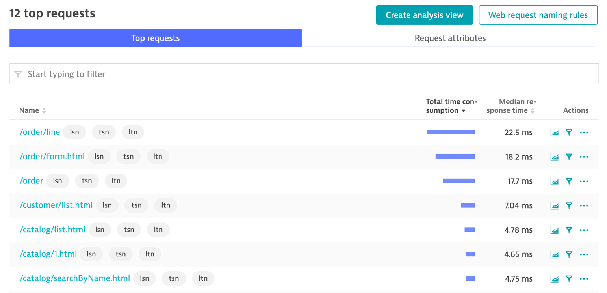
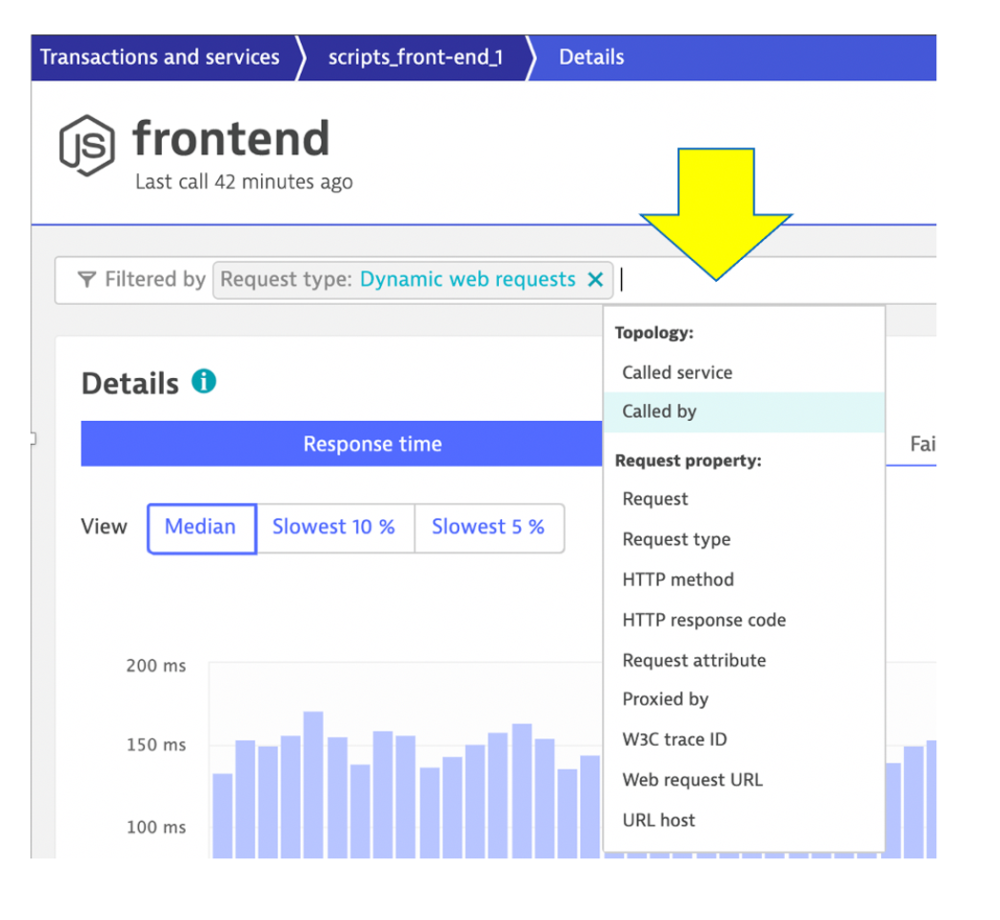

## Services

Web applications consist of web pages that are served by web servers and web application processses, for example Tomcat. Web and mobile applications are built upon services that process requests like web requests, web service calls, and messaging. 

Such "server-side services" can take the form of web services, web containers, database requests, custom services, and more. Services may in turn call other services such as web services, remote services, and databases services.

## 👍 How this helps

As you plan your migration, it is important to gain a complete picture of interdependency to the rest of the environment architecture at host, processes, services, application perspectives. Since time is always scarce, being able to do this in a single place can shorten assessment timelines.

## Review Service

Let’s now take a look at the transactions and Services by clicking on the `Transactions and services` left side Dynatrace menu.

💥 **TECHNICAL NOTE**: There a lot of services in this list. To help manage this list a [Dynatrace auto-tagging rule](https://www.dynatrace.com/support/help/how-to-use-dynatrace/tags-and-metadata/) was added by the workshop scripts and we can now use a tag filter to make this list more manageable.

Management zones are a powerful information-partitioning mechanism that promote collaboration and the sharing of relevant team-specific data while simultaneously ensuring secure access control.

In the management zone drop down, choose `monolith`.
 

It should look like this:

From the `Dynamic Web Requests` section on the right, click the `view Dynamic Requests` button to see what it calls. 

On this page you can view the transactions as time-series charts.

On this page you can view the top 15 requests and their response time consumption. 

By clicking on one of the requests, the time-series charts are filtered to just that one request.

## Request attributes

💥 **TECHNICAL NOTE**: Are wondering what the "lsn", "ltn", and "tsn" are all about?

Dynatrace tracks all requests, from end to end, and automatically monitors the services that underlie each transaction. The performance and attributes of each request can be analyzed in detail. You can even create custom multi-faceted filters that enable you to analyze call sequences from multiple perspectives. 

With such advanced request filtering, Dynatrace enables you to slice and dice your way through your requests to find the proverbial “needle in the haystack.” Such filtering isn't only possible on certain predefined attributes. You can also configure custom request attributes that you can use to improve filtering and analysis of problematic web requests.

The load traffic script was built to send a custom header for each request with information for:
* "lsn" - load script name
* "ltn" - load test name
* "tsn" - test step name

See this repo for how the Dynatrace configuration was done.
https://github.com/dt-orders/load-traffic/blob/main/README.md#dynatrace-setup

## 👍 How this helps

This is a more advanced feature, bet very powerful. In this example, a test script send in custom header information, but information in you apps might already available.  You can read more on the topic in the [Dynatrace docs](https://www.dynatrace.com/support/help/how-to-use-dynatrace/transactions-and-services/basic-concepts/request-attributes/) 