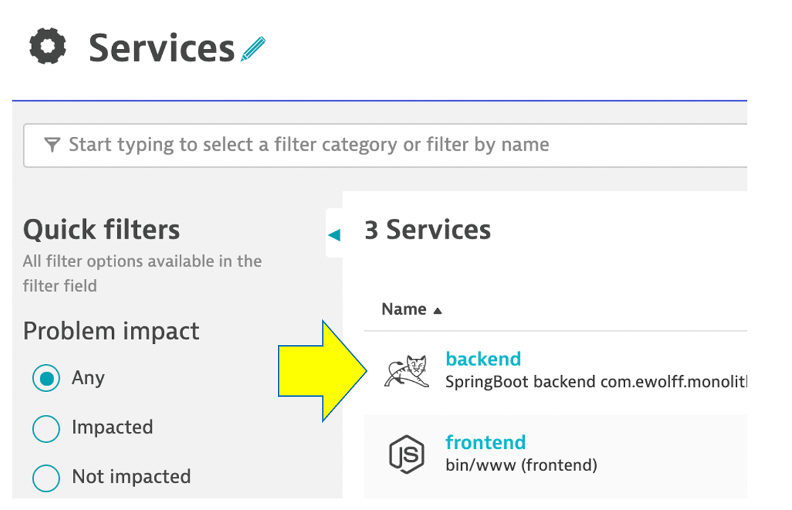
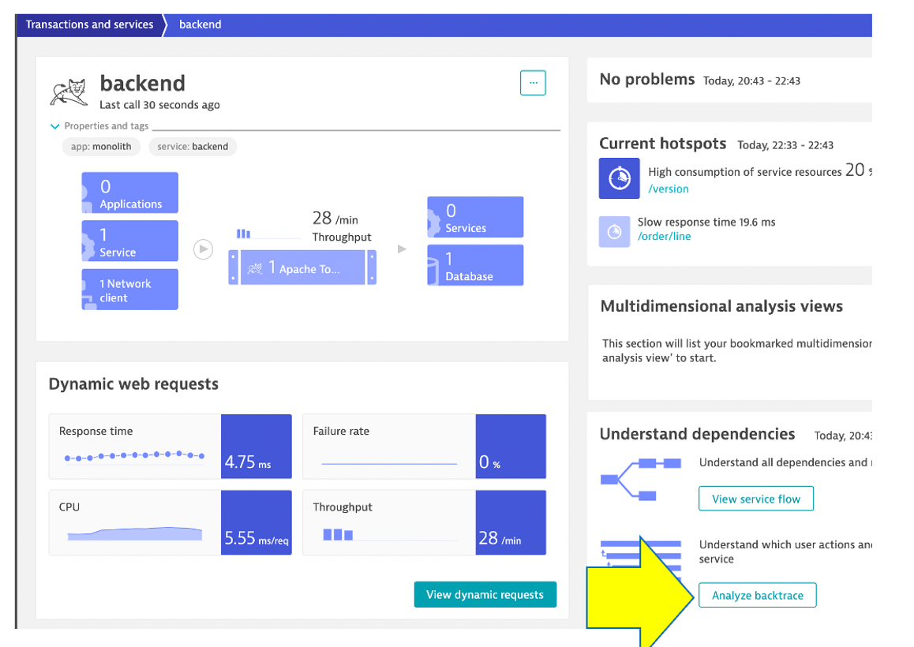

## Analyze service backtrace

Dynatrace understands your applications transactions from end to end. This transactional insight is visualized several ways like the backtrace. 

The backtrace tree view represents the sequence of services that led to this service call, beginning with the page load or user action in the browser.

## 👍 How this helps

Using the service flow and service backtrace, these two tools give you a complete picture of interdependency to the rest of the environment architecture at host, processes, services, application perspectives. 

## Review Service backtrace

Let’s now take a look at the transactions and Services by clicking on the `Transactions and services` left side Dynatrace menu.

Pick the `backend` service.

On the **backend** service, click on the **Analyze Backtrace** button.

You should be on the service backtrace page where you will see information for this specific service.

This will get more interesting in the next lab, but for the monolith backend, we can see that the backtrace is as follows:

1. The starting point is the `backend`
1. `backend` is called by the `frontend` service
1. `Apachejmeter` traffic from the load generator script
1. `frontend` is a where end user requests start and the user sessions get captured within the `My web application` by default

