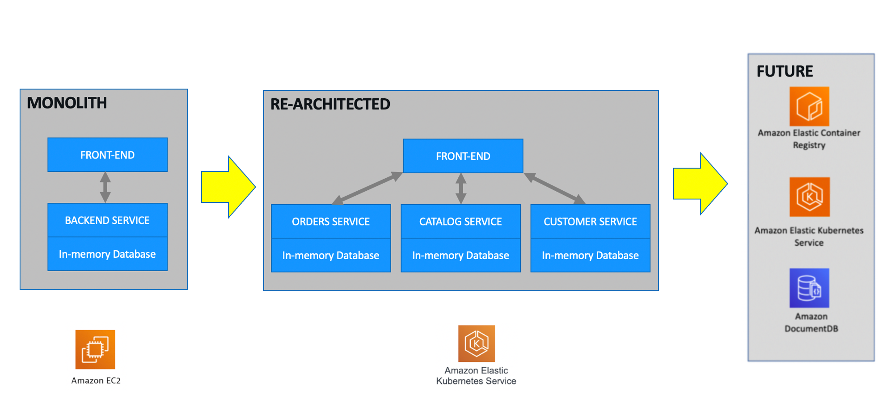

## Sample App Modernization

Re-hosting (also referred to as lift and shift) is a common migration use case. Re-architecture and Re-platform are steps that break the traditional monolithic architectures and replace individual components with cloud services, such as Amazon Relational Database Service (Amazon RDS), which replaces on-premises relational databases) and Amazon DynamoDB, which replaces NoSQL databases. These steps can also replace newly-developed microservices, including containerized or serverless.

We just learned how we can get great information on back-end services, front-end API services, or user-facing features using Dynatrace and OneAgent. This helps us now decide what individual features or complete applications based on business benefits we need to migrate and modernize. The idea here is to focus on feature-based business benefit with functional migration.

## Identify

EasyTravel is a monolithic Java application that as we saw earlier provides several web services like Booking, Authentication, and Journey.

Our overall goal at easyTravel is to breakout each of these backend services into separate services. This will allow us to have separate Continuous Integration (CI) pipelines to build and test each service independantly. By putting these service into Docker images, we gain the ability to deploy the service into modern platforms like Kubernetes using AWS managed services. By adding Continuous Deployment (CD) to our process, we will vastly increase our ability to delivery features faster to our customers.

## Sample App Modernization

Sample app broken up as into "services" architecture of a frontend and backend services.  The application was implemented as two Docker containers that we will review in this lab within Dynatrace.

