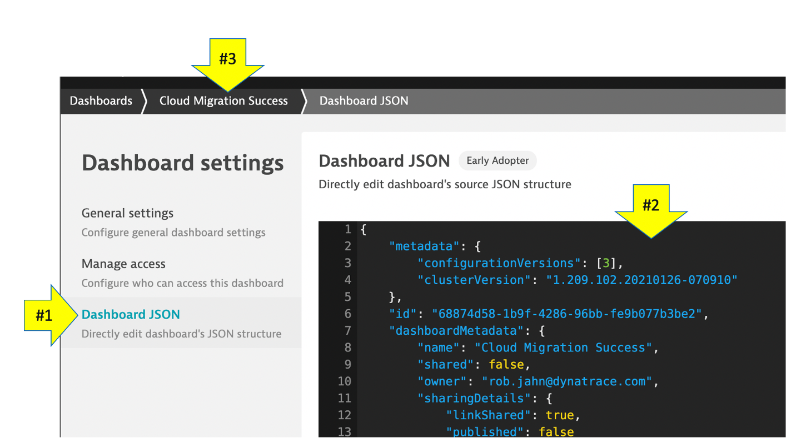

## Before and After Dashboard

From the left side menu in Dynatrace, pick the `dashboard` menu.

On the dashboard page, click the `new dashboard` button.

Provide a dashboard name like `Cloud Migration Success`

On the blank dashboard page, click the settings.  Then click the `advanced settings` link to open then settings page

Referring to this picture, follow these steps:

1. On the settings page, click the `dashboard JSON` menu.
1. In the JSON window copy-n-paste this provide JSON into it - [RAW JSON](https://raw.githubusercontent.com/robertjahn/perform-2021-hotday-migration/main/dashboard/cloud-migration-dashboard.json)
1. Click the `Cloud Migration Success` bread crumb menu to go back to the dashboard page

You should now see the dashboard

Now you need to edit the dashboard and adjust the tiles with the SLOs and databases in your environment.

On the top right of the page, click the `edit` button.  Follow this guide

    1. Click on the Dynamic requests tile to edit
    1. Pick the monolith `frontend` service
    1. Click done

Repeat for the Cloud tile, but pick the `k8-frontend` service

Repeat for the two SLO tiles
Repeat for the two database tiles. Note there are 3 k8 database, so just pick one.

click the `Done` button to save the dashboard

