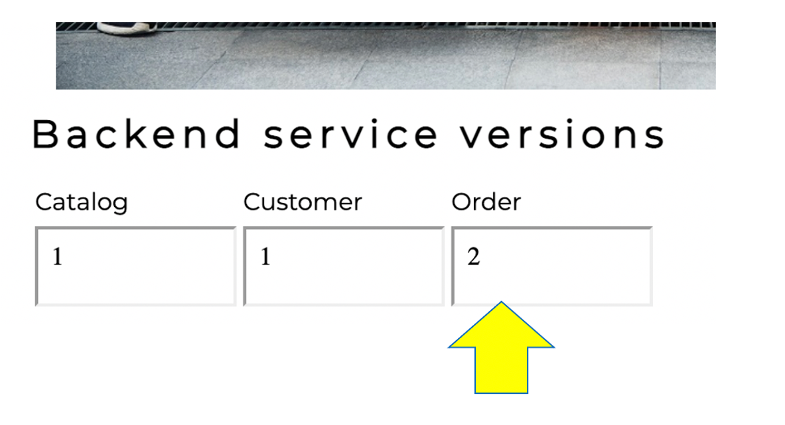
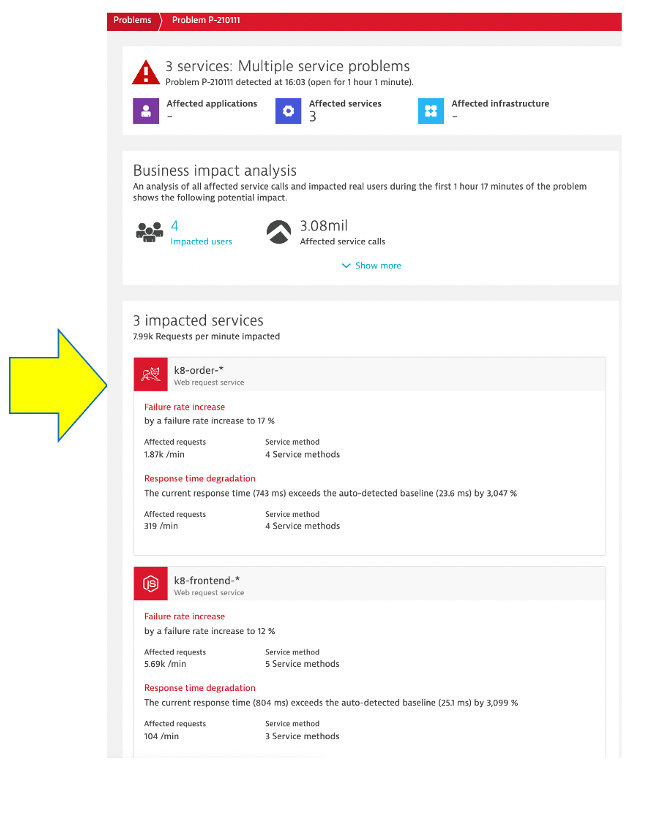
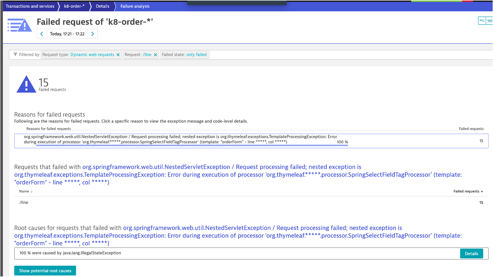

## Enable another problem

Now we are going to look at `order-service` version 2 that causes two problems, but lets review the first one:
* failure time issues on the `Click the Add Line to an Order (/order/line request)`
* Refer to the [dt-orders overview README](https://github.com/dt-orders/overview#pre-built-docker-images) for more details.

## Enable the problem pattern

Run these commands to turn off the other problem and enable another one. we will simple run a `kubectl` command that will update the running deployment.

Back in the SSH terminal, just run these commands.

```
kubectl -n dt-orders set image deployment/customer customer=dtdemos/dt-orders-customer-service:1
kubectl -n dt-orders set image deployment/order order=dtdemos/dt-orders-order-service:2
```

You should see `deployment.apps/order image updated` as the output.

## View app in browser

If you need the URL again, run this command and copy the `EXTERNAL-IP` for the frontend

```
kubectl -n dt-orders get svc
```

The browser should now show version 2 for order, and version 1 for customer.



## Review Kubernetes deployment

While we wait for the problem to show up, lets review the deployments.  Start with this command:

```
kubectl -n dt-orders get deploy -o=wide
```

or you can use the kubernetes labels to filter the list with this command:

```
kubectl -n dt-orders get deploy -o=wide -l=service=order
```

To view the details of the `order` deployment, run this command and notice you are running `Image: dtdemos/dt-orders-order-service:2`

```
kubectl -n dt-orders describe deploy order
```

Where did this come from?  We automated this, but this is the deployment file for customer if you want to look. [View customer-service.yaml](https://github.com/dt-orders/overview/blob/master/k8/order-service.yaml)

## Review problem in Dynatrace

The problem may take a minute to show up, but this is what the problem will look like once it does.



## Analyze problem

Open up the `k8-order` service.  Do this from problem page if there by clicking on it.  -OR- find and click on it from the 'transactions and services` left side menu.

On this page, notice the failure rate.  


Then click on the failure rate box to open the request page.

If you notice, its just one request with an issue not all of them.


Clikc on the `/line` request to add it to the filter.  You should not see the same time series chart with a higher failure rate.


Click on the `view details of failures` button to view the real issue with the request.



