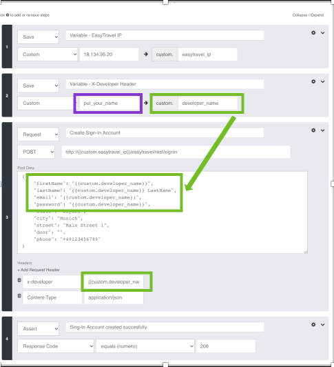

## REST Sign-In

### REST Sign-In (Create Account) EasyTravel

We are asked to test the REST Sign-In and Login functionality of  Easytravel. To understand the flow of the transaction, response time and architecture. We are only given the REST Endpoint.

```bash
POST hhttp://{{custom.easytravel_ip}}/easytravel/rest/signin
```

JSON Body
```json
{
    "firstName": "{{custom.developer_name}}",
    "lastName": "{{custom.developer_name}} LastName",
    "email": "{{custom.developer_name}}",
    "password": "{{custom.developer_name}}",
    "state": "Bayern",
    "city": "Munich",
    "street": "Main Street 1",
    "door": "",
    "phone": "+49123456789"
}

```

We are going to pass this attributes into the POST request.
```bash
HTTP Headers:
Content-Type: application/json
x-developer: yourname
```

For this we can use cURL, Postman or any REST tool. Here is an API Test already preconfigured for you [API TEST Template for SingIn](https://apitester.com/shared/checks/961787656e25474a903dd5dd917d7570 )


- The test consists of basically 2 steps, POST request and an assert.
- Modify the X-Developer Header with **your_name_identifier**.
- This value will be used as email and password for the creation of the SignIn. (just for keeping things simple)

### Create an Account via REST


- Click on Test
- It should pass all 4 steps.
- Now, click on „Test„ again. Yes, with the same data. Let‘s try to create the same Sign-In Account. 
- The test should fail. What error code did you get?