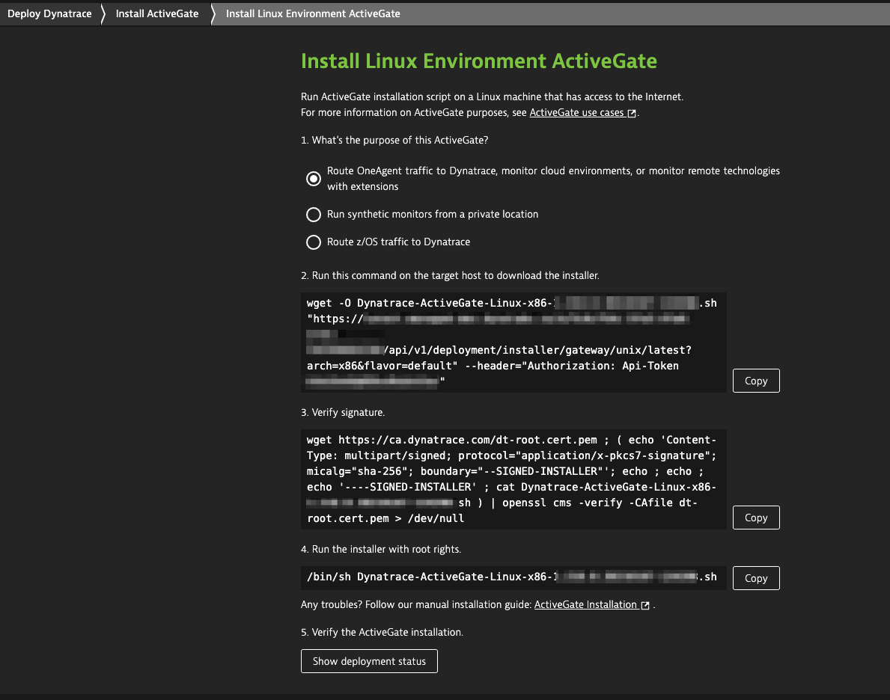

## Install Environment ActiveGate

In this step, we're going to install an Environment ActiveGate. Completing this step is required to deploy an ActiveGate extension in the following activity.

> ActiveGate is a multi-purpose remote data acquisition, pre-processing and forwarding module of Dynatrace. If you need to expand your monitoring capabilities to allow for monitoring of services in AWS, Azure, GCP, CloudFoudry, Kubernetes, VMware, IBM Z mainframe systems, perform Synthetic monitoring, or execute extensions capable of monitoring or additional technolgies, you'll need ActiveGate to perform these tasks. ActiveGate is also capable of routing the data from your OneAgents to Dynatrace Clusters and can act as a configurable secure network data proxy.

We're going to use the Environment ActiveGate to execute an extension that fetches license consumption data from Dynatrace and exposes it as additional metrics. 

### Prerequisites
- Installed Dynatrace Managed cluster
- Access to the cluster with admin rights
- Access to the _ActiveGate host_
- `Licensing` environment was created

To get started, sign into your Dynatrace Managed cluster with an `admin` account and navigate to the *Licensing* environment created before. Follow steps below in order to download and install Environment ActiveGate.

### Step 1: Start installation

1. Select **Deploy Dynatrace** from the navigation menu
1. Select **Install ActiveGate**. 
1. Select the **Linux** platform.

See screenshot below as an example:


### Step 2: Download the Environment ActiveGate installer
1. Select the purpose: **Route OneAgent traffic to Dynatrace, monitor cloud environments, or monitor remote technologies with extensions**
1. Copy the `wget` command line from the text box, and paste the command into your terminal window on an `active-gate` machine. Make sure you copy the command directly from the first text box, because it contains your environment ID.
1. Verify the signature
Wait for the download to complete. Then verify the signature by copying the command from the second **Verify signature** text box and pasting the command into your terminal window.

### Step 3: Run the installer
Installation parameters are automatically set for the command. Make sure you use the command displayed in the Dynatrace web UI that reflects the ActiveGate purpose.

1. Before you install ActiveGate, run the following command in the directory where you downloaded the installation script.

   ```bash
   (activegate)$ chmod +x Dynatrace-ActiveGate-Linux-x86-1.207.0.sh
   ```

1. Copy the installation script command from the *Run the installer with root rights* step, paste it into your terminal and execute it.

### You've arrived 
After Environment ActiveGate connects to Dynatrace, installation is complete.

To check the status of the installation, click **Show deployment status* and select the *Dynatrace ActiveGates** tab. You can learn more about [Dynatrace Active Gate](https://www.dynatrace.com/support/help/shortlink/activegate-hub) at Dynatrace Help.