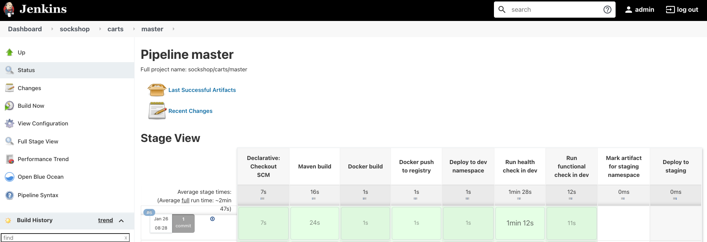
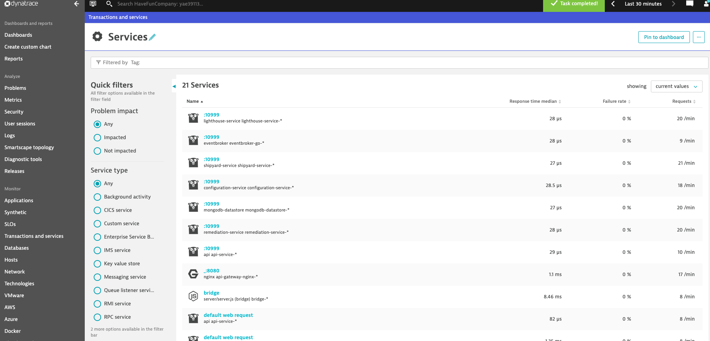

## Environment overview and configuration
Before getting started configuring our quality gate we will review the build and release process and trigger a full build from development up to production using Jenkins and our applications carts.

### Step 1 - Get into the virtual machine using ssh
In order to get into our working environment we will be using an ssh to conect to our AWS machine. 
```(bash)
 $ ssh username@aws-ip 
 use the ip and password from Dynatrace University
```

### Step 2 - Explore the different namespaces using kubectl
Out of the box we have applications running in our Kubernetes cluster using k3s. In order to visualize the namespaces where the applications live run the following command 
```(bash)
$ kubectl get namespaces
```
You should see something like this: 

```(bash)
NAME              STATUS   AGE
default           Active   10m
kube-system       Active   10m
kube-public       Active   10m
kube-node-lease   Active   10m
dynatrace         Active   10m
ingress-nginx     Active   9m31s
gitea             Active   9m5s
dev               Active   7m2s
staging           Active   7m2s
production        Active   7m2s
registry          Active   7m1s
jenkins           Active   7m
dashboard         Active   5m8s
```
We will be working with some of these namespaces to deploy our application across the different stages from dev > staging > production

In order to visualize what's already running in a namespace use:

```(bash)
kubectl -n dev get all 
```
You should see the database for the carts microservice already in there.
```(bash)
NAME               TYPE           CLUSTER-IP     EXTERNAL-IP   PORT(S)        AGE
service/carts-db   ClusterIP      10.43.20.194   <none>        27017/TCP      9h
```
### Step 3 - Review the ingress configuration
To understand more about the way our applications are exposed we can look for our ingress configuration. 

```(bash)
kubectl get ingresses --all-namespaces
```
```(bash)
NAMESPACE   NAME                CLASS    HOSTS                                      ADDRESS     PORTS   AGE
gitea       gitea-gitea         <none>   gitea.xx.xx.xxx.nip.io                  10.0.0.90   80      9h
jenkins     jenkins             <none>   jenkins.xx.xx.xxx.nip.io                10.0.0.90   80      9h
```
### Step 4 - Explore Gitea
Navigate into Gitea by using the host domain from step 3. Username and password will be provided during the lab.


### Step 5 - Explore Jenkins
Navigate into Jenkins by using the host domain from step 3. Username and password will be provided during the lab.


### Step 6 - Build the first version of the application
Go into `Jenkins > sockshop > carts` and trigger the first build of the application. After the build is done, you can visualize the microservice running in dev using ```kubectl -n dev get deploy carts```. Since this is a backend service with an API interface, you can hit the API using the url `carts.dev.xxx.xxx.xx.nip.io`


### Step 7 - Explore and configure Dynatrace
Navigate into your Dynatrace environment and go to Transactions and services to visualize the new service running.



As you see, it's difficult to locate an specific service with the current configuration, next we are going to solve that by creating service tags. This would allow us to identify our services in later labs.

#### Part 1: Create a Naming Rule for Process Groups
1. Go to **Settings**, **Process and containers**, and click on **Process group naming**.
1. Create a new process group naming rule with **Add new rule**. 
1. Edit that rule:
    * Rule name: `Container.Namespace`
    * Process group name format: `{ProcessGroup:Environment:app}.{ProcessGroup:KubernetesNamespace}`
    * Condition: `Kubernetes namespace`> `exists`
1. Click on **Preview** and **Create rule**.
#### Part 2: Create Service Tag for app based on process group info
1. Go to **Settings**, **Tags**, and click on **Automatically applied tags**.
1. Create a new custom tag with the name `app`. **THIS TAG NAME IS CASE SENSITIVE.**
1. Edit that tag and **Add new rule**.
    * Rule applies to: `Services` 
    * Optional tag value: `{ProcessGroup:Environment:app}`
    * Condition on `app(Environment)` if `exists`
1. Click on **Preview** to validate rule works.
1. Click on **Create rule** for saving the rule and then **Save changes**.
#### Part 3: Create Service Tag for Environment based on K8S Namespace
1. Go to **Settings**, **Tags**, and click on **Automatically applied tags**.
1. Create a new custom tag with the name `environment`. **THIS TAG NAME IS CASE SENSITIVE.**
1. Edit that tag and **Add new rule**.
    * Rule applies to: `Services` 
    * Optional tag value: `{ProcessGroup:KubernetesNamespace}`
    * Condition on `Kubernetes namespace` if `exists`
1. Click on **Preview** to validate rule works.
1. Click on **Create rule** for saving the rule and then **Save changes**.


### Step 8 - Release the first version to staging
Go into `Jenkins > sockshop > create-release-branch` and use `carts` as parameter to create a new branch for our release to staging. Then go into `Jenkins > sockshop > Scan Multibranch Pipeline Now` to visualize the new branch created and trigger automatically a new build.

After the build has finished run `kubectl -n staging get deploy carts` to see the microservice running in the staging environment.

### Next steps
We have now a working version of our microservice running in the environments `dev` and `staging`, but we haven't implemented any quality checks yet. In the next labs, we will configure `Keptn + Dynatrace + Jenkins` to implement a Quality Gate and we see how this can prevent bad builds from being promoted from one environment into the next one.
