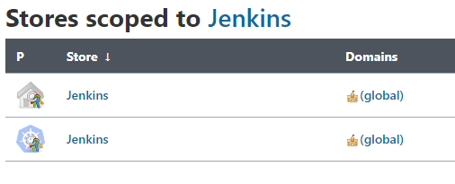

## Configure Keptn library for Jenkins
In this exercise you'll learn how to configure the Keptn library for Jenkins.


### Step 1: Review Keptn library installation

Following the `everything as code` best practice, we have configured Jenkins to use a `Yaml` file to grab all the configurations for our environment. One of those configurations is the keptn library for Jenkins that we will be using to simplify the communication between the keptn API and Jenkins. 

1. In order to check the library configuration in the yaml file use the following command and search for `globalLibraries` on line `474`.

    **Note:** if you need to enable line numbers in vim, you can do so following these steps:

    1. Press the `Esc` key to switch to command mode.
    1. Press `:` (colon) and the cursor will move at the bottom left corner of the screen.
    1. Type `set number` or `set nu` and hit `Enter`.

  ```(bash)
  vi ./bootstrap/box/helm/jenkins-values-gen.yml 
  ```
  You should see something like this 

    ```yaml
          globalLibraries:
            libraries:
            - name: "dynatrace"
              retriever:
                modernSCM:
                  scm:
                    git:
                      id: "6813bac3-894e-434d-9abb-bd41eeb72f88"
                      remote: "https://github.com/dynatrace-ace/dynatrace-jenkins-library.git"
                      traits:
                      - "gitBranchDiscovery"
            - defaultVersion: "master"
              name: "keptn-library"
              retriever:
                modernSCM:
                  scm:
                    git:
                      remote: "https://github.com/keptn-sandbox/keptn-jenkins-library.git"
                      traits:
                      - "gitBranchDiscovery"
    ```


2. You can also visualize the library in the Jenkins  UI by navigating to `Jenkins > Manage Jenkins > Configure System > Global Pipeline Libraries`.


### Step 2: Get Keptn credentials

Retrieve the Keptn credentials using the following

```bash
 export KEPTN_API_TOKEN=$(kubectl get secret keptn-api-token -n keptn -ojsonpath={.data.keptn-api-token} | base64 --decode)
 echo $KEPTN_API_TOKEN
 export KEPTN_BRIDGE=http://$(kubectl -n keptn get ingress keptn -ojsonpath='{.spec.rules[0].host}')/bridge
 echo $KEPTN_BRIDGE
 export KEPTN_ENDPOINT=http://$(kubectl -n keptn get ingress keptn -ojsonpath='{.spec.rules[0].host}')/api
 echo $KEPTN_ENDPOINT
```

### Step 3: Store Keptn credentials in Jenkins

 In this step we will add the Keptn credentials into Jenkins. 
 1. To access jenkins, find your URL by running:

    ```bash
    export JENKINS_URL=http://$(kubectl get ing jenkins -n jenkins -ojsonpath={.spec.rules[0].host})
    echo $JENKINS_URL
    ```
    You can log in using:
    - Username: `admin`
    - Password: `dynatrace`

 1. Inside Jenkins go into `Manage Jenkins > Manage credentials ` and select the first element with the house icon.
 
    

2. Then click `Global credentials > Add credentials`, use the dropdown Kind and select `secret text` and input the values from step 2. Repeat the process for each variable. For the ID field use the name from the images.

    
    
    

  Your final result should look similar to this:
  