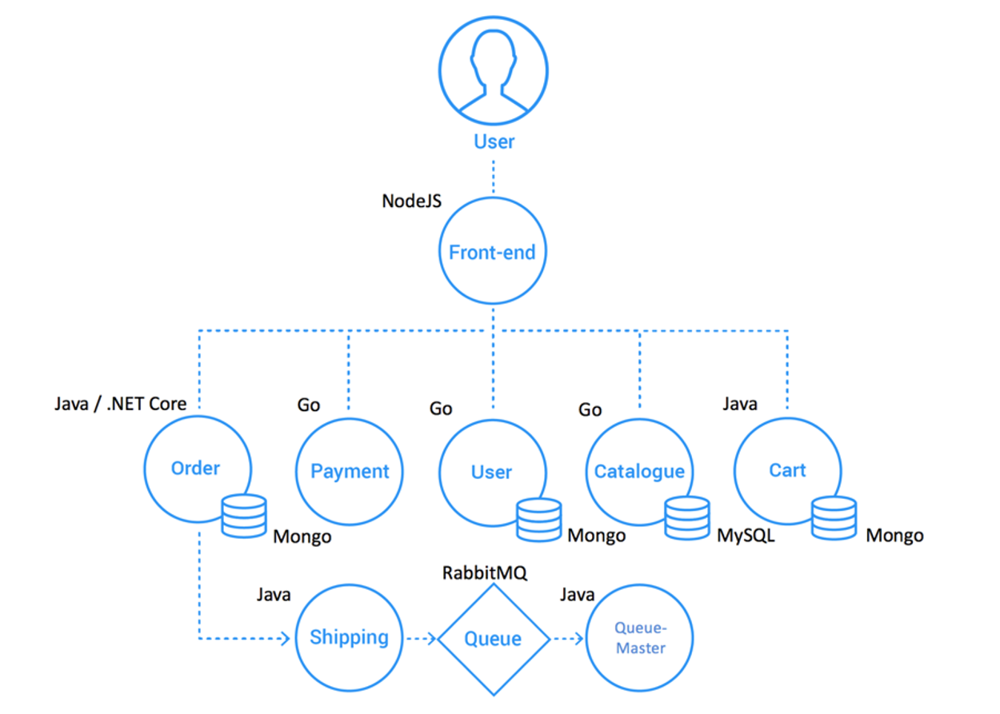

## Shift-Left SRE with Keptn Quality Gates in CD
SRE practices are taking over the enterprise application release landscape. Continuous automated release validation by evaluating Service Level Objectives is a key requirement for organizations to release software faster and more frequently without inhibiting quality. During this Hands-On Trainig, we will go over Keptn Quality Gates and how it can be used in conjunction with a CI/CD pipeline to detect regressions faster in order to achieve true shift-left.

### The Application
We will be using a microservice called `carts` which is part of our `sockshop` application that emulates a marketplace for buying socks. The `carts` microservice is build using Java with a mongo-db database, and is responsible for the shopping cart process.

### Technology Overivew
In order to build this application we will be using the following technologies.
 - **Jenkins**
    
    As our CI/CD orchestrator, Jenkins will build and deploy our application in the corresponding environments. It will be responsible for integrating our different technologies.

 - **Gitea**

    Instead of using a public repository like github for hosting our pipeline definitions and required files to build our application, we will be using a self hosted source control using the gitea project. https://gitea.io

 - **JMeter**

    JMeter will be use to automated performance testing against our different application endpoints.

 - **Keptn**

    Based on the SLO/SLI definitions we will provide, Keptn will be responsible over the quality gate evaluation. 

 - **Dynatrace**

    Monitoring the application during the test execution will allow us to measure the performance of our application.

 - **Kubernetes on K3s**

    We will use Kubernetes running on K3s to create the base infraestructure to run our pipeline.
