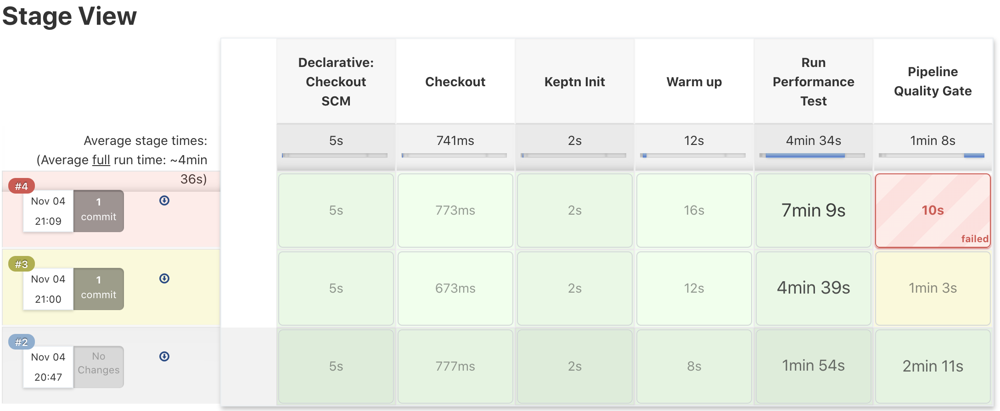

## Run Performance Test on Carts Service

In this exercise you'll measure the performance for the carts service 3 times. The first time you'll run the test and create a baseline for future runs. The second time you will introduce a small slowdown that will be evaluated as a warning SLO result. The third time you will increase the slowdown to see how the pipelines fails when it goes beyond the SLI objetive for the response time.

### Step 1: Run Performance Test on current Implementation

1. Go to your **Jenkins** homepage and click on **sockshop** folder.
1. Click on **carts**, then **master**.
1. Click on **Build with parameters** to trigger the pipeline. (leave the default values).
1. Wait until the pipeline build exists with a *Success* status.

### Step 2: Introduce a small slowdown in the Carts Service

1. In the directory of `carts\`, open the file: `carts\src\main\resources\application.properties`.
1. Change the value of `delayInMillis` from `0` to `500`.
1. Commit/Push the changes to your GitHub Repository *carts*.

### Step 3: Build this new Version

1. Go to **Jenkins** and click on the **sockshop** folder.
1. Click on **carts** and select the **master** branch.
1. Click on **Build Now** to trigger the pipeline.
1. Wait until the Jenkins build exists with a *Success* status.

### Step 4: Run Performance Test on new Version

1. Go to **Jenkins** and click on the **sockshop** folder.
1. Click on **carts.performance** and select the **master** branch.  
1. Click on **Build with parameters** to trigger the performance pipeline (leave the default values).
1. Wait until the Jenkins build is set to *Unstable* (yellow color).

### Step 5: Introduce a larger slowdown in the Carts Service

1. In the directory of `carts\`, open the file: `carts\src\main\resources\application.properties`.
1. Change the value of `delayInMillis` from `500` to `800`.
1. Commit/Push the changes to your GitHub Repository *carts*.

### Step 6: Build this new Version

1. Go to **Jenkins** and click on the **sockshop** folder.
1. Click on **carts** and select the **master** branch.
1. Click on **Build Now** to trigger the pipeline.
1. Wait until the Jenkins build exists with a *Success* status.

### Step 7: Run Performance Test on new Version

1. Go to **Jenkins** and click on the **sockshop** folder.
1. Click on **carts.performance** and select the **master** branch.  
1. Click on **Build with parameters** to trigger the performance pipeline (leave the default values).
1. Wait until the Jenkins build **fails**

You should be able to see something similar to this image:

